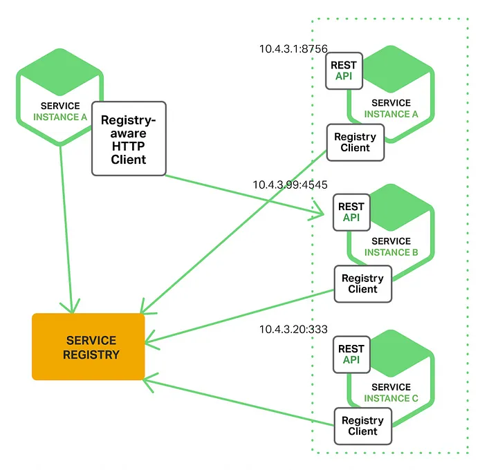

# ent-service-discovery

Service Discovery is the automatic detection of devices and services offered by these devices on a computer network. In a microservices architecture, where there might be dozens or even hundreds of services, it is essential to know what services are available and how to communicate with them. Service Discovery solves this problem by maintaining a registry of available services, their instances, and their locations (Ip addresses, or ports..).

